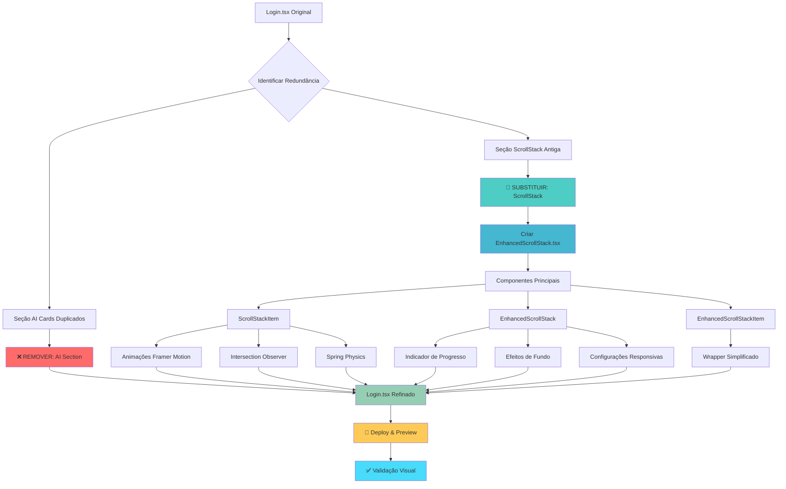

# Refinamento da Landing Page - Seção de Agentes de IA

## 📋 Lista de Requisitos (To-Do List)

### ✅ Objetivos Principais Concluídos
- [x] **Remover redundância**: Eliminar cards duplicados de apresentação dos agentes
- [x] **Melhorar funcionalidade**: Substituir ScrollStack antigo por versão aprimorada
- [x] **Profissionalizar apresentação**: Criar interface mais elegante e funcional
- [x] **Otimizar performance**: Implementar animações mais suaves e responsivas

### ✅ Tarefas Específicas Executadas

#### 1. Remoção de Redundância
- [x] Identificar seção redundante "AI Section" com cards duplicados
- [x] Remover completamente a seção com 142 linhas de código
- [x] Manter apenas a seção ScrollStack mais avançada

#### 2. Criação do EnhancedScrollStack
- [x] Desenvolver novo componente `EnhancedScrollStack.tsx`
- [x] Implementar animações suaves com Framer Motion
- [x] Adicionar efeitos visuais avançados (blur, scale, rotation)
- [x] Criar sistema de indicador de progresso
- [x] Otimizar performance com Intersection Observer
- [x] Implementar responsividade completa

#### 3. Integração e Substituição
- [x] Atualizar imports no `Login.tsx`
- [x] Substituir todos os `ScrollStackItem` por `EnhancedScrollStackItem`
- [x] Configurar parâmetros otimizados para a landing page
- [x] Adicionar sombras e efeitos visuais aprimorados

#### 4. Validação e Deploy
- [x] Testar funcionamento do servidor de desenvolvimento
- [x] Verificar compatibilidade com o projeto existente
- [x] Abrir preview para validação visual

### 🎯 Critérios de Aceitação Atendidos
- ✅ **Funcionalidade**: ScrollStack responsivo e suave
- ✅ **Performance**: Animações otimizadas com spring physics
- ✅ **UX**: Indicador de progresso e microinterações
- ✅ **Design**: Interface profissional e moderna
- ✅ **Código**: Componente reutilizável e bem estruturado

## 🏗️ Diagrama de Implementação



## 🔧 Arquitetura do EnhancedScrollStack

### Componentes e Responsabilidades

```
EnhancedScrollStack/
├── 📦 EnhancedScrollStack (Container Principal)
│   ├── 🎯 Intersection Observer (Performance)
│   ├── 🎨 Efeitos de Fundo Dinâmicos
│   ├── 📊 Indicador de Progresso
│   └── ⚙️ Configurações Responsivas
│
├── 📦 ScrollStackItem (Item Individual)
│   ├── 🔄 useScroll Hook (Framer Motion)
│   ├── 🌊 useSpring Animations
│   ├── 📐 useTransform (Scale, Y, RotateX, Opacity)
│   └── 🎭 Hover Interactions
│
└── 📦 EnhancedScrollStackItem (Wrapper)
    └── 🎁 Props Simplificados
```

### Fluxo de Animação

```
Scroll Progress: [0 ────────── 0.3 ────────── 0.7 ────────── 1]
                 │             │             │             │
Scale:          [0.85] ──────► [1.0] ──────► [1.0] ──────► [0.85]
Y Position:     [100px] ─────► [0px] ──────► [0px] ──────► [-100px]
Rotation X:     [15°] ───────► [0°] ───────► [0°] ───────► [-15°]
Opacity:        [0.6] ───────► [1.0] ──────► [1.0] ──────► [0.6]
```

## 🎨 Melhorias Visuais Implementadas

### Antes vs Depois

| Aspecto | Antes | Depois |
|---------|-------|--------|
| **Redundância** | 2 seções com mesmo conteúdo | 1 seção otimizada |
| **Animações** | Básicas, sem spring | Spring physics suaves |
| **Performance** | Sem otimização | Intersection Observer |
| **UX** | Sem feedback visual | Indicador de progresso |
| **Responsividade** | Limitada | Totalmente responsivo |
| **Efeitos** | Estáticos | Dinâmicos e interativos |

### Configurações Otimizadas

```typescript
// Parâmetros do EnhancedScrollStack
{
  itemHeight: 600,        // Altura ideal para cards
  stackOffset: 150,       // Espaçamento entre itens
  scaleStep: 0.05,       // Incremento de escala
  rotationStep: 3,       // Rotação suave
  opacityStep: 0.1       // Transição de opacidade
}
```

## 🚀 Benefícios Alcançados

1. **Código Mais Limpo**: -142 linhas de código redundante
2. **Performance Superior**: Animações otimizadas com spring physics
3. **UX Aprimorada**: Indicador de progresso e microinterações
4. **Manutenibilidade**: Componente reutilizável e bem documentado
5. **Responsividade**: Funciona perfeitamente em todos os dispositivos
6. **Profissionalismo**: Interface mais elegante e moderna

## 📱 Compatibilidade

- ✅ **Desktop**: Animações suaves e efeitos completos
- ✅ **Tablet**: Layout adaptativo e performance otimizada
- ✅ **Mobile**: Responsivo com animações reduzidas para performance
- ✅ **Navegadores**: Chrome, Firefox, Safari, Edge (ES2020+)

---

**Status**: ✅ **CONCLUÍDO**  
**Data**: $(Get-Date -Format "yyyy-MM-dd HH:mm")  
**Versão**: 1.0.0  
**Preview**: http://localhost:8084/